## Top level structure

The `src` folder is the most important one, it contains all the Rust code.

Other important folders are:

- `assets`: App logo, and pre-built libraries are put here for the APK to pick up. Non bundled static assets such as screenshots for README.md also go here.
- `patches`: Temporary patches for dependencies like `smithay` and `xbuild`. These patches allows us to experiment with the dependencies, and we will contribute back to the upstream when we think the changes are good enough.
- `scripts`: Miscellaneous automation scripts, such as the script to check for 16 KB ELF alignment.
- `tests`: Rust integration tests.
- `target`: Your build artifacts go here.

## Source code structure

```mermaid
flowchart TD
    Src["📁 src/"]
    Src --> Lib["📄 lib.rs"]
    Src --> AndroidMain["📄 android_main.rs"]
    Src --> App["📁 app/"]
    Src --> Proot["📁 proot/"]
    Src --> Utils["📁 utils/"]
    Src --> Wayland["📁 wayland/"]
```

- `lib.rs`: This file behaves more like a contact book. You only register the modules here, no actual logic goes here.
- `android_main.rs`: Did you see that `#[no_mangle] android_main` function? Android apps do not have a `main` function, instead:
  - When you open an Android app (by clicking the app icon), Android will launch an activity.
  - An activity is a Java class that extends `android.app.Activity`. Polar Bear is written in pure Rust, so we registered a special `NativeActivity`.
  - The `NativeActivity` will load the `android_main` inside `libpolar_bear.so` (the object into which all of our Rust code is compiled). That's why we need the `#[no_mangle]` annotation, to prevent Rust compiler from changing the function name.

So `android_main.rs` is the genesis of all the spaghetti code. In case you got lost, just put a breakpoint at the beginning of this function and follow the execution flow.

We will comeback to explaining other folders later.

## Execution flow

```mermaid
flowchart TD
    Start["🚀 User taps the app icon"]
    Native["📱 NativeActivity is started"]
    Load["📦 libpolar_bear.so is loaded"]
    Main["▶️ android_main() is executed"]

    subgraph App
        PolarBearApp["🐻‍❄️ PolarBearApp"]

        PolarBearApp --> Frontend["❄️ PolarBearFrontend"]
        PolarBearApp --> Backend["🐻 PolarBearBackend"]

        Backend --> Webview["🌐 WebviewBackend"]
        Backend --> Wayland["🎨 WaylandBackend"]

        WebviewTasks["📘 Show documentation in webview"]
        WebviewProgress["⏳ Show progress bar"]
        WebviewBg["⚙️ Run installation in background"]

        WaylandStart["🖼️ Start the Wayland compositor built with Smithay and EGL, listen on /tmp/wayland-0"]
        Xwayland["🖥️ Launch Xwayland via Proot & listens on :1"]
        Xfce4["🧩 Xfce4 binds to :1 and shows apps"]
    end

    Start --> Native --> Load --> Main --> PolarBearApp

    Webview --> WebviewTasks
    Webview --> WebviewProgress
    Webview --> WebviewBg

    Wayland --> WaylandStart
    WaylandStart --> Xwayland --> Xfce4
```

