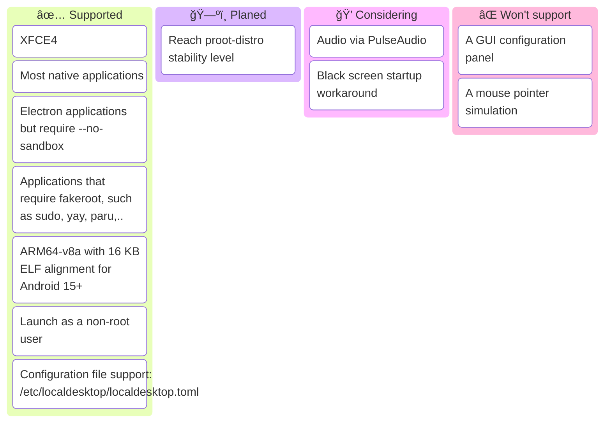

```mermaid
kanban
    ✅ Supported
        XFCE4
        Most native applications
        Electron applications but require --no-sandbox
        Applications that require fakeroot, such as sudo, yay, paru,..
        ARM64-v8a with 16 KB ELF alignment for Android 15+
        Launch as a non-root user
        Configuration file support: /etc/localdesktop/localdesktop.toml

    ğŸ—ºï¸ Planed
        Reach proot-distro stability level

    💭 Considering
        Audio via PulseAudio
        Black screen startup workaround

    ⌠Won't support
        A GUI configuration panel
        A mouse pointer simulation
```
